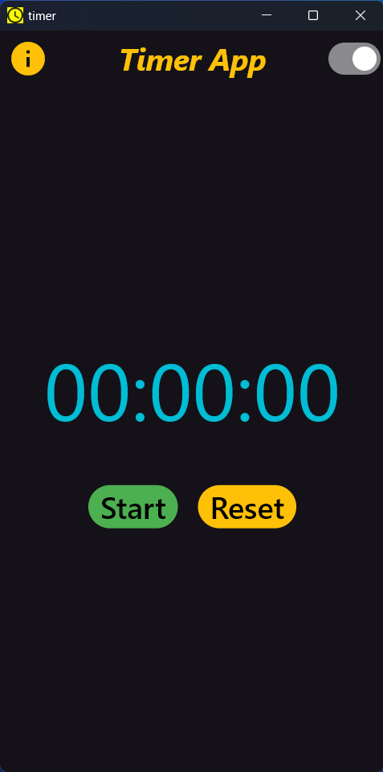
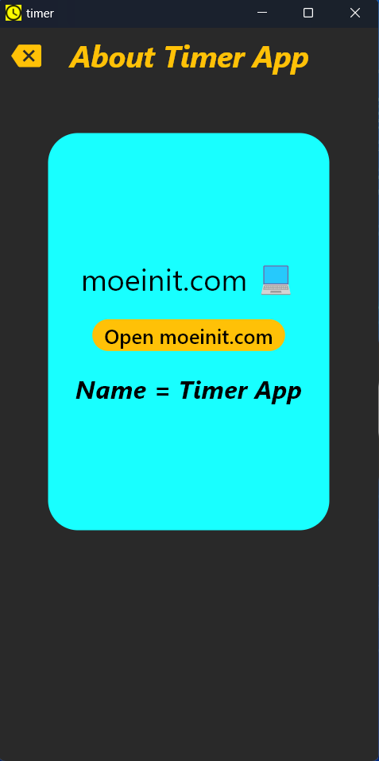

My Flutter Project : Timer App (moeinit.com)

# ⏱️ Flutter Timer App

A simple and practical **Flutter** project for managing time, including a timer and stopwatch.  
This app is designed as a learning and demo project, and it runs on **Android**, **Windows**, and other Flutter-supported platforms.

## About the Project
Developed by [moeinhe83](https://github.com/moeinhe83), the main goal of this project is to practice and demonstrate Flutter concepts such as building user interfaces with **Material Design**, managing state with **StatefulWidget**, using **AppBar**, **BottomNavigationBar**, and **Navigator**, and adding extra features like Dark/Light theme switching and opening links in the browser.

## Features
- Display timer in `HH:MM:SS` format
- **Start** and **Reset** buttons
- Info page with a link to the developer’s website
- Support for **Dark Mode** and **Light Mode**
- Minimal and clean design with readable colors (Amber, Cyan)
- Cross-platform support (Android, Windows, Linux, macOS, Web)

## Getting Started

# Images For App



### Prerequisites
- Install [Flutter SDK](https://flutter.dev/docs/get-started/install)
- Install Android Studio or VS Code with Flutter/Dart plugins
- Emulator or device for testing (Android Emulator, Windows Desktop, etc.)

### Run the App
```bash
# Clone the repository
git clone https://github.com/moeinhe83/Flutter_Timer.git

# Navigate into the project folder
cd Flutter_Timer

# Get dependencies
flutter pub get

# Run the app on your desired platform
flutter run -d windows   # For Windows
flutter run -d android   # For Android
